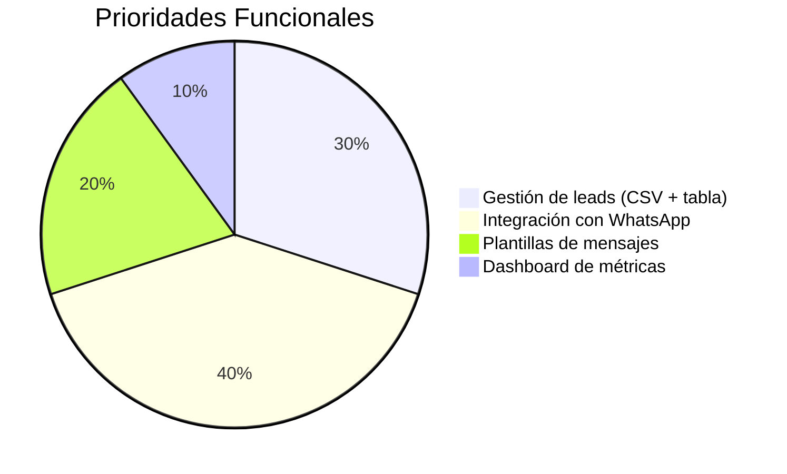
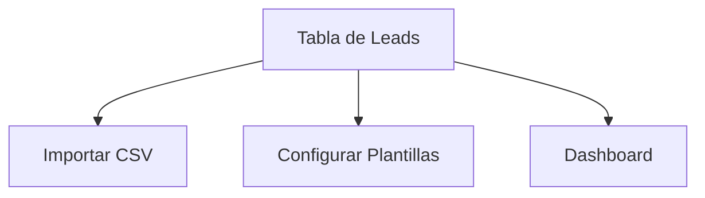
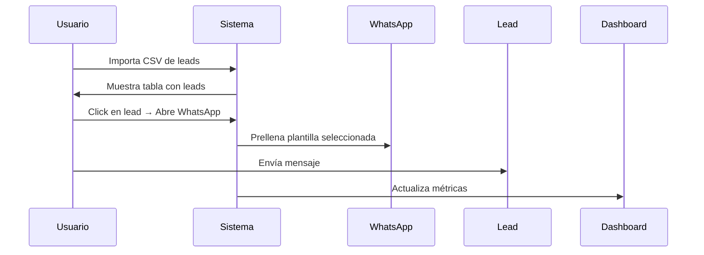

# Propuesta de Desarrollo MVP: Automatización de Mensajes WhatsApp  

Para: Repensar

---

## a) Analizar el Problema  

### 1. Descripción del Negocio  

Repensar gestiona leads educativos captados mediante Meta Ads, que son contactados manualmente por WhatsApp. El equipo de ventas enfrenta desafíos en:  

- Respuestas inconsistentes: Mensajes escritos desde cero o copiados de notas.  
- Falta de seguimiento centralizado: No hay registro unificado de interacciones.  
- Tiempos de respuesta elevados: Demora en contactar leads frescos.  

Público objetivo interno:  

- Equipo de ventas (5-10 usuarios).  
- Leads potenciales (220/semana).  

### 2. Dolor Actual (Pain Points)  

| Problema                   | Impacto                                      |  
|----------------------------|----------------------------------------------|  
| Gestión manual de mensajes | 40% del tiempo se pierde en redactar textos. |  
| Seguimiento desorganizado  | 30% de leads se pierden por falta de registro.|  
| Retraso en respuestas      | Tiempo promedio de contacto: 1-2 horas.      |  

### 3. Beneficios Esperados  

- Reducción del 70% en tiempo de gestión mediante plantillas preconfiguradas.  
- Aumento del 20% en conversiones por seguimiento estructurado.  
- Centralización de datos: Registro histórico de interacciones y etiquetado de leads.  

---

## b) Definir el Alcance  

### 1. Funcionalidades Core (Must-Have)  



#### Tabla de leads

- Campos básicos: Nombre, WhatsApp, correo opcional.  
- Carga masiva vía CSV: Soporte para archivos de hasta 1,000 registros.  

#### Plantillas por etapa del Course

- Bienvenida: Mensaje inicial con enlaces a programas.  
- Seguimiento: Recordatorios personalizados.  
- Cierre: Ofertas finales.  
- Etiquetado automático: Categorización por curso y etapa.  

### 2. Restricciones Técnicas  

- Dispositivos: Acceso desde WhatsApp Web (Desktop) y móvil.  
- Seguridad: Autenticación de 2 factores para el equipo de ventas.  
- Presupuesto: Desarrollo con tecnologías open-source (React, Node.js, PostgreSQL).  

### 3. Entregables Mínimos (MVP)  

Sistema básico de gestión de leads con:  

- Tabla filtrable y búsqueda.  
- Integración directa con WhatsApp (click-to-chat).  
- 3 plantillas de mensajes predefinidas.  
- Dashboard con métricas de mensajes enviados/respuestas.  

---

## c) Wireframes y Bocetos  

### 1. Mapa del Sitio  



### 2. Interfaz de Baja Fidelidad  

#### Pantalla: Tabla de Leads  

```mermaid  
+-----------------------------------+  
| Buscar | Importar CSV | Filtros   |  
+-----------------------------------+  
| Nombre  | WhatsApp | Etapa  | Curso |  
|-----------------------------------|  
| Juan Pérez | +51... | Nuevo  | Marketing |  
| María Gómez| +51... | Seguimiento | UX |  
+-----------------------------------+  
```

#### Pantalla: Configurar Plantillas  

```mermaid
+------------------------------+  
| Lista de Plantillas (+)      |  
|------------------------------|  
| 1. Bienvenida                |  
|   - Texto: "Hola {nombre}..."|  
| 2. Seguimiento               |  
+------------------------------+  
```

### 3. Flujo de Uso  



## d Estructurar el Documento

### Ordenar Lógicamente

El documento está estructurado siguiendo una narrativa de problema-solución para facilitar la comprensión:

1. Identificación del problema.
2. Definición del alcance del proyecto.
3. Propuestas visuales para ilustrar el flujo y la interfaz del sistema.

### Filtrar los Resultados Clave

KPIs Críticos:

- Tiempo de respuesta <5 minutos.
- 90% de uso de plantillas automatizadas.
- Incremento del 20% en conversiones.

MVP Prioritario: Tabla de leads, integración con WhatsApp, plantillas predefinidas y dashboard básico.

### Mantener el Formato Markdown

Se utiliza formato Markdown para una presentación clara y compatible con distintas herramientas. Los diagramas Mermaid mejoran la visualización de flujos y prioridades funcionales.
